# Home Network Security Lab

A hands-on home lab built to demonstrate practical network security and identity
administration skills — designed as a portfolio project alongside CompTIA
Security+ and Microsoft SC-300 (Identity and Access Administrator).

The lab runs entirely on virtual machines: a **pfSense** firewall/router
segments a network into four isolated VLANs with least-privilege rules, a
**Microsoft Entra ID** tenant demonstrates identity and access management with
just-in-time privileged access, and a **Wazuh** SIEM deployment provides
centralized monitoring.

## Architecture

- **WAN** connects the firewall out to the internet.
- **LAN** is the management network — the only segment with routed access to
  the firewall's admin interface and to the internet, and locked down from
  reaching the VLANs behind it.
- Four **VLANs** (802.1Q tagged, all riding the same physical/virtual wire)
  provide isolated zones: **Trusted**, **IoT**, **Guest**, and **Lab/DMZ**.
  Each can reach the internet but is explicitly blocked from reaching any
  other private network — enforced with a block-then-allow firewall rule
  pair on every interface.

## What's Inside

### Network segmentation (pfSense)
- Firewall/router built from scratch as a VM, with WAN and LAN interfaces
- Four VLANs, each with its own subnet and DHCP scope
- Least-privilege firewall rules: every VLAN (and the management LAN) blocks
  traffic to other private ranges via a reusable firewall alias, then allows
  everything else out to the internet
- Rule order enforced deliberately (block before allow) since pfSense
  evaluates top to bottom and stops at the first match

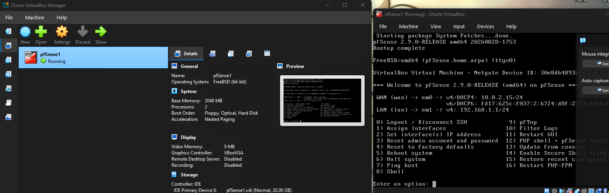
*pfSense fully installed — WAN pulling a DHCP address, LAN serving 192.168.1.0/24.*

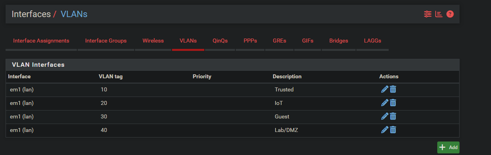
*Trusted, IoT, Guest, and Lab/DMZ — four tagged VLANs riding the same physical LAN wire.*

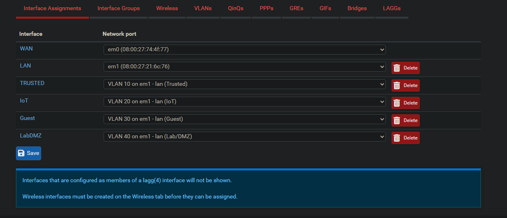
*Each VLAN assigned as its own interface with a dedicated subnet.*

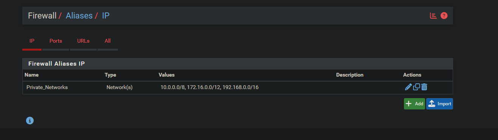
*The Private_Networks alias referenced by every VLAN's block rule, instead of retyping subnets four times over.*

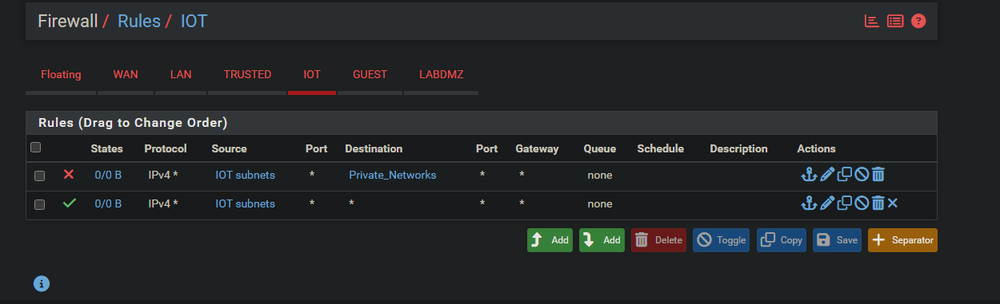
*The actual least-privilege pattern: block anything headed to another private network, then allow what's left — the internet.*

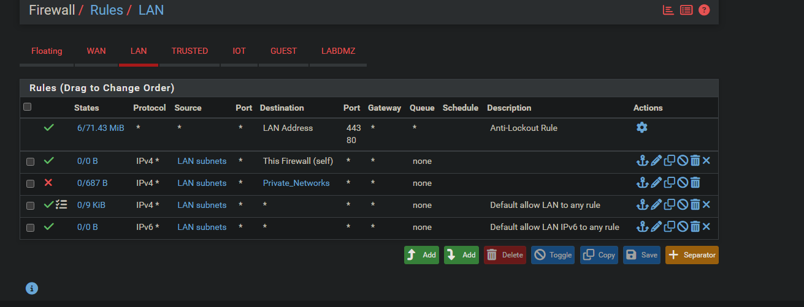
*The Phase 6 fix: LAN can still reach the firewall itself and the internet, but no longer has unrestricted access into the VLANs.*

### Identity and access management (Microsoft Entra ID)
- Scoped test users and a security group, kept isolated from other tenant
  activity
- **Privileged Identity Management (PIM):** an admin role is *eligible*
  rather than permanently assigned — activation requires justification and
  MFA, and is time-boxed and logged, rather than the account holding
  standing access at all times
- **Conditional Access** policy requiring MFA, scoped to the project's test
  group rather than the whole tenant

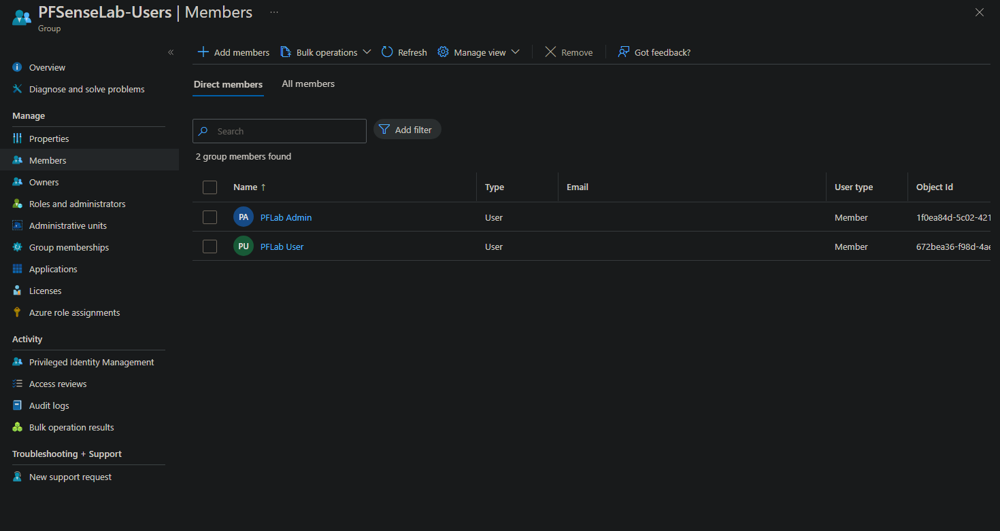
*PFSenseLab-Users — exactly the two test accounts, nothing else in the tenant swept in.*

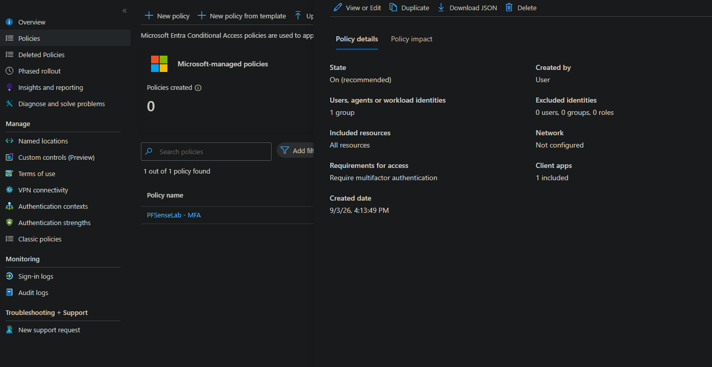
*Scoped to one group, actively enforcing (not report-only).*

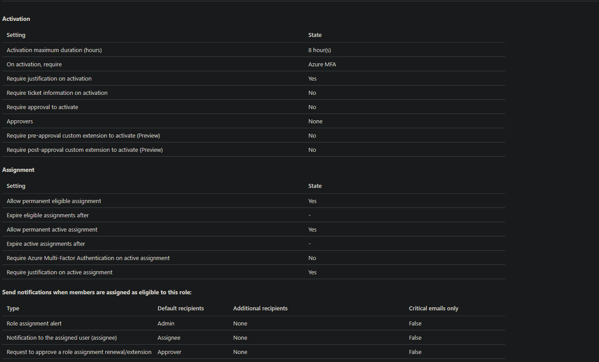
*Global Administrator eligibility: 8-hour bounded activation, MFA and justification required.*

### Monitoring (Wazuh SIEM)
- Wazuh manager, indexer, and dashboard deployed as an all-in-one VM
- Self-monitoring confirmed via the manager's built-in local agent

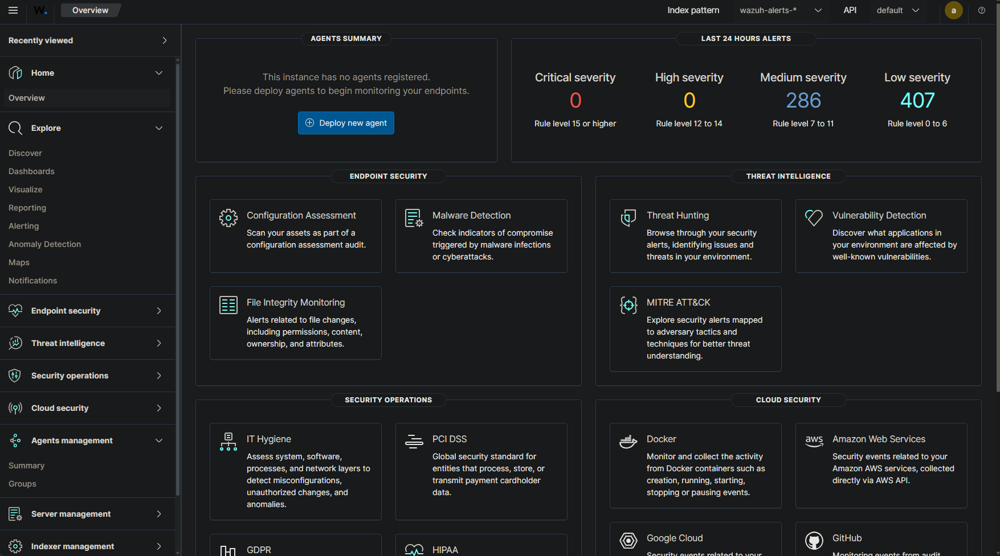
*Real alert counts from self-monitoring — note the "no agents registered" panel is expected here; the manager's built-in local agent (000) doesn't count toward that widget, it's a known dashboard quirk, not a gap in coverage.*

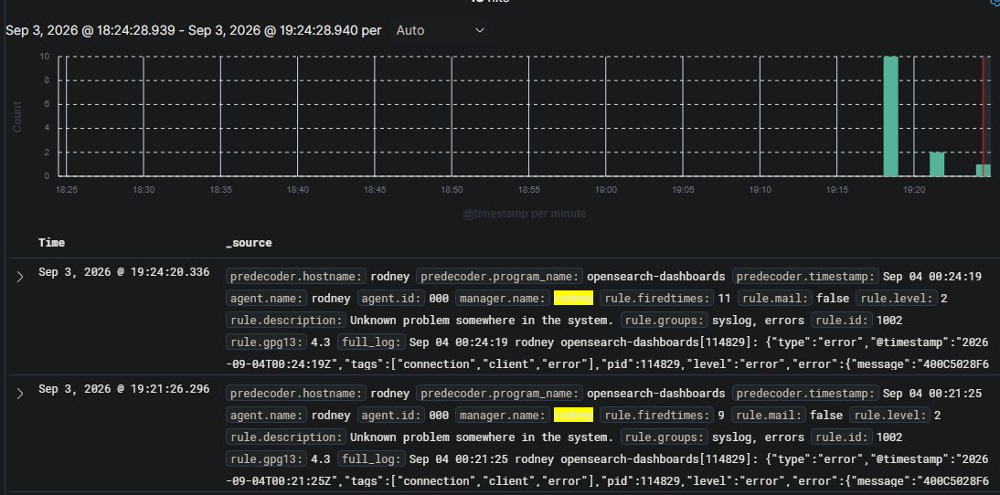
*Agent 000 — the manager's built-in local agent — actively reporting events.*

## Notable Troubleshooting

Lab work issues that I ran into and the process of which they were solved:

- **Installer instability:** the pfSense installer's daemon repeatedly failed
  to connect, and a NIC driver mismatch prevented interface detection —
  traced to the emulated network adapter type and resolved by switching to a
  better-supported driver.
- **Wi-Fi bridging failure:** WAN, bridged over a Wi-Fi adapter, appeared to
  work (DHCP succeeded) but failed to reliably reach the internet — a known
  limitation of bridging over 802.11. Fixed by switching to NAT.
- **Disk corruption after an interrupted install:** a stuck reboot script led
  to filesystem corruption on a ZFS install; resolved by reinstalling with
  UFS, which is less sensitive to interrupted writes.

- **DNS resolution failure behind the firewall:** LAN clients couldn't
  resolve any domain, despite the resolver service showing as running.
  Root cause, found by checking the resolver's own logs: **DNSSEC validation
  and DNS forwarding were both enabled**, a documented conflict — DNSSEC's
  trust-anchor priming fails in forwarding mode, causing the resolver to
  refuse all queries. Fixed by disabling DNSSEC support.

  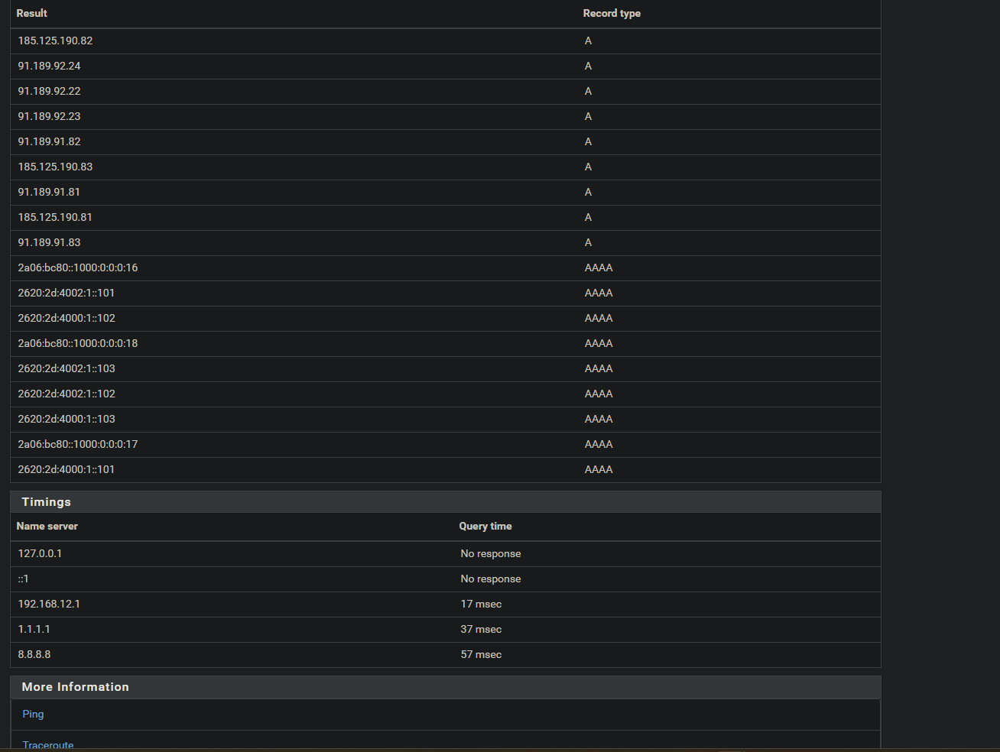
  *Before: even pfSense's own loopback query gets no response — the resolver isn't answering anything.*

  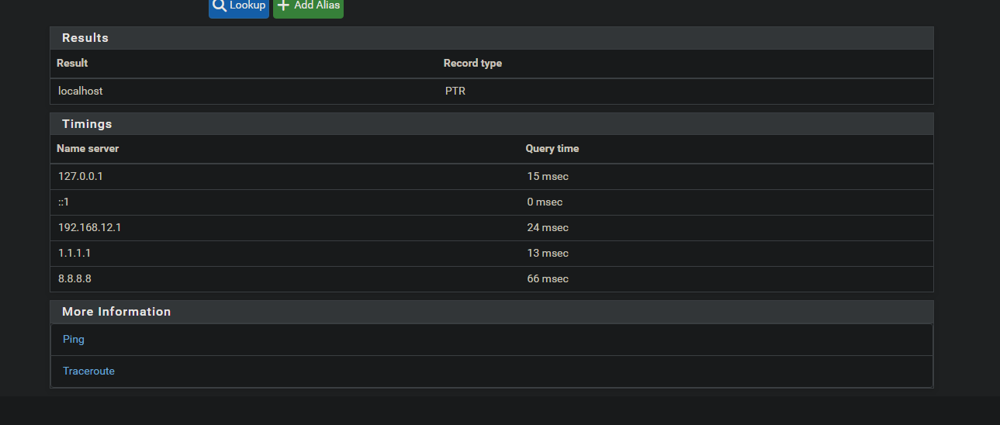
  *After: localhost resolves in 15ms once DNSSEC and forwarding stopped conflicting.*

- **Silent under-allocated disk:** a Wazuh install failed with a "disk full"
  error on a VM with plenty of free space — the Ubuntu installer's guided
  LVM setup had only allocated half the virtual disk to the root volume.
  Fixed by extending the logical volume and filesystem to use the full disk.

  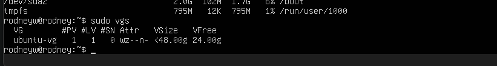
  *24GB sitting completely unused in the volume group — half the disk was never handed to the filesystem that needed it.*

- **Package conflict:** installing a Wazuh agent on the same host as the
  Wazuh manager silently removed the manager entirely, since the two
  packages conflict. The manager already includes built-in self-monitoring
  (agent ID 000) — no separate agent was needed in the first place.

## Setup

This lab runs on VirtualBox. Broadly: a pfSense VM with a WAN adapter (NAT)
and LAN adapter (Host-only), four VLANs configured on top of the LAN
interface, a separate Ubuntu Server VM running the Wazuh all-in-one install,
and a Microsoft Entra ID tenant for the identity layer. See the
troubleshooting notes above for the non-obvious parts.
